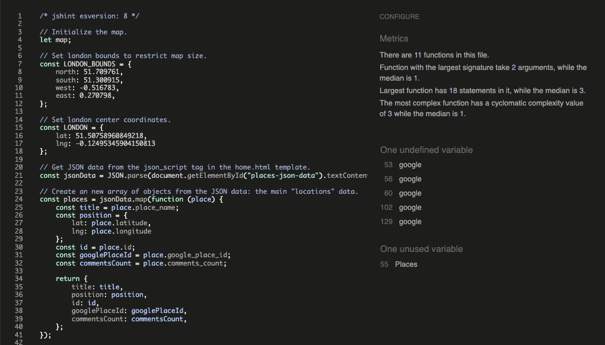

# Magical Places - London


View the live site [here](https://magical-places-london-7d2df0d61638.herokuapp.com/).

## Introduction

**Magical Places - London** is site for sharing recommendations on hidden gems - the sometimes under-the-radar places that inspire joy and wonder.

It’s aimed at people that, for example, have a free afternoon and are looking for something inspiring to do; they can quickly look at the map at which interesting places are near, and save a favourites list to remind them of what to see in the future.

### Project Goals

The goals for the site’s functionality were:

- Map view: users can view all ‘places’ on a map on the home page.
- User authentication: users can create an account, sign in and have permissions to edit and delete the comments that they create.
- Commenting: users have the ability to create, read, update and delete (CRUD) comments.
- Favouriting: users can favourite and unfavourite a place, and view a list of their favourite places.
- Create place: users can create a ‘place’ by filling out an autocomplete form powered by the Google Places API.

## Agile Development

### User Stories

A Kanban board in Github projects was used for the Agile development process - see the board [here](https://github.com/users/timgoalen/projects/3).

‘Epics’ were broken down into ‘User Stories’, which were further broken down into ‘Tasks’.

## User Experience (UX) Design

### Wireframes

Low-fidelity wireframes were used to test the design before building the site.

Home page:


List page:


Detail page (mobile):


Detail page (tablet):


Add a Place page:


### Navigation


### Data Schema


note: a separate 'Favourite' model was created for the purpose of being able to sort the users Favourites chronologically.

### Google Maps JavaScript Flow Diagrams

One of the biggest challenges faced while building this site is the implementation of the Google Places photos. 

The first approach was to save to the database a URL obtained with the `getURL()` method.
That problem in this approach is that these URLs would expire after a few days,  giving a 403 error message when trying to display the photo. 

Google `photo_reference` data is no longer supplied with the JavaScript API, and there are new Google terms and conditions that don’t allow a `photo_reference` to be cached, and instruct the developer get a new link every time, using a `PlaceDetails` request.  

I then had to design a JavaScript system that used the Google `place_id` stored in the database to send a new `PlaceDetails` request every time the page is loaded to get the photos, and dynamically add them to the page.

I used a loading-spinner div (without the spinner) to cover a section of the page as the photos were being fetched.

**Add a Place functionality - *‘place-add-form.js’***

The search field in the Add a Place page uses the Google Autocomplete class and the Place Details service:


**Home page - *‘script.js’***

The Places objects are sent to the HTML template as a JSON array of objects. JavaScript picks them up and uses the `google_place_id` to send requests to Google Places API for the photos. It then re-attaches each newly fetched photo to the corresponding Place object using the `id` as a reference.


### Colour Scheme


The colour scheme was chosen to give an earthy and inviting impression to the user.

Contrast accessibility was checked for with [Eightshapes Contrast Grid](https://contrast-grid.eightshapes.com/) and some of the originally chosen colours were darkened to improve their contrast ratio.


('Does Not Pass' combinations are hidden in this example)

### Typography


It was used in the light 300 weight, and the regular 400 weight. It was chosen for its strong personality yet good readability.

### Google Maps Custom Styles

The custom appearance of the map was created with Map Styles in Google Maps Platform on the Google Cloud Console. The colours were chosen from the site’s colour scheme. 

The custom pin appearance was created in the site’s main red (#BF553B), directly in the JavaScript code:

`const customPin = new PinElement({
background: "#BF553B",
scale: 0.9,
borderColor: "#fff",
glyphColor: "#fff",
});`

## Features

### Home page


The main map page, where users can click on map pins to see an info box with photo and place name:


The ‘Add’ icon is on the bottom right is only shown for logged in users.

The display or either ’Log In’ or ‘Log Out’ icons in the top right reflect the users state.

### Add a Place

Where users can add a place by typing in to a search field that uses the Google Places Autocomplete to suggest existing places. Once the user clicks on a suggested place, the hidden form is automatically filled in by JavaScript, from the data provided by the Google Places API.


notes:

- The ability for a user to edit or delete a Place that they have added wasn't implemented:
    - As the form data is not user-generated, and rather supplied by the Google Places API, there is a low chance or user error that would justify ‘edit’ functionality.
    - If the user had the ability to delete places that were already commented on, other users would lose their comments and lose access to the place if it was in their favourites list.
- A fallback image was added for places that don’t have a corresponding Google image.

### List page


Places can be favourited/unfavourited by clicking on the heart icon.

The user can sort the list by ‘Newest’, ‘A-Z’ and ‘My Favourites’.

If a user doesn’t have any favourites yet, this message is displayed:


Sorted by ‘Favourites’:


### Detail page

The detail page is where the user can:

- create, read, update and delete a comment
- favourite/unfavourite a place
- view the place address
- view the number of comments

Desktop layout:


Mobile layout:


### Add comment


### Edit comment


### Delete comment


### Log In


### Log Out


### Sign Up


### 404 Page


### 500 Page


## Features to Implement in the Future

- Pagination: add pagination to the list page and detail page comments.
- Geolocation: add ‘locate user on the map’ functionality.
- New list-page sort option: sort by most commented place.
- Password reset: add ability to reset password.
- Social sign-in: allow users to sign in with their Google/Apples/etc. accounts.
- Google Places API (new): update to the new version of the API.
- Google ‘place_ids’ can, in theory, expire; a system would be needed for if this happens.
- User’s created places: allow users to view a list or map of all the places they have created.
- User profiles: a user page with a list of places created and comments left, either private to the user or publicly accessible.
- Jest testing: create a suite of JavaScript test using JEST.

In general, the code could easily be repurposed to create similar sites with a different focus in the places being shared (e.g. cycling-cafes/kids activities/rock-climbing centres etc.).

## Technologies Used

- Languages:
    - Python
    - JavaScript
    - HTML5
    - CSS3
- Framework:
    - Django
- Database:
    - PostgreSQL
- [Visual Studio Code](https://code.visualstudio.com/) - as the code editor.
- [Git](https://git-scm.com/) - for version control, using the Gitpod IDE.
- [GitHub](https://github.com/) - for storing the project.
- [ElephantSQL](https://www.elephantsql.com/) - PostgreSQL as a service.
- [Heroku](https://www.heroku.com/) - to deploy the application.
- [Cloudinary](https://cloudinary.com/) - to host the static files.
- [Chrome Developer Tools](https://developer.chrome.com/docs/devtools/) - to test responsiveness, edit CSS code, debug JavaScript and generate Lighthouse reports.
- [Google Fonts](https://fonts.google.com/) - to import the site font, ‘Oswald’.
- [Figma](http://figma.com) - to create the wireframes.
- [Font Awesome](https://fontawesome.com/) - for all the site icons.
- [Gauger Fonticon](https://gauger.io/fonticon/) - for the favicon.
- [Coolers](https://coolers.co/) - for an overview of the chosen colour palette.
- [Am I Responsive](https://ui.dev/amiresponsive) - to create the responsive demo image at the top of the Readme.
- [Excalidraw](https://excalidraw.com/) - to create the navigation diagram.
- [Lucidchart](https://www.lucidchart.com/pages/) - to create the database schemas.
- [TinyPNG](https://tinypng.com/) - to compress the Readme images.
- [Quicktime](https://support.apple.com/en-gb/guide/quicktime-player/welcome/mac) - to record the screen capture for GIFs in the readme.
- [Ezgif](https://ezgif.com/) - to convert the Readme GIFs.
- [Quillbot](https://quillbot.com/) - for rephrasing demo comments.
- [WebAIM WAVE](https://wave.webaim.org/) - for automated testing of accessibility.
- [WebAIM Contrast Checker](https://webaim.org/resources/contrastchecker/) - to check colour contrast accessibility.
- [Eightshapes Contrast Grid](https://contrast-grid.eightshapes.com/) - to visualise the contrast accessibility of the whole site colour palette.
- [Code Institute’s Python Linter](https://pep8ci.herokuapp.com/) - for automated testing of the Python code.
- [JSHint](https://jshint.com/) - to test the JavaScript code.
- [W3C Markup Validator](https://validator.w3.org/) - to test the HTML code.
- [W3C CSS Validator](https://jigsaw.w3.org/css-validator) - to test the CSS code.

### APIs Used

- [Google Maps JavaScript API](https://developers.google.com/maps/documentation/javascript/overview) - to run the home page map.
- [Google Places API](https://developers.google.com/maps/documentation/places/web-service/overview) - to get details and photos from place searches.

### Python Packages Used

- [django-allauth](https://docs.allauth.org/en/latest/index.html) - for user authentication.
- [gunicorn](https://gunicorn.org/) - as the HTTP server that allows Django to run on Heroku.
- [psycopg2](https://pypi.org/project/psycopg2/) - as the PostgreSQL database adapter for Python.
- [dj_database_url](https://pypi.org/project/dj-database-url/) - to allow the use of the `DATABASE_URL` environment variable inside Django.
- [Coverage.py](http://Coverage.py) - to measure test coverage of the Python code.

## Testing

### Automated Testing

**Python Unit Tests**

Extensive unit tests were written for the Python code in Django, achieving a 94% coverage.


**Python Linting**

Python linting was carried out with https://pep8ci.herokuapp.com/.

There were no warnings left in the production code apart from the ‘line too long’ errors on the boilerplate Django code in ‘settings.py’.

**JavaScript Linting**

All JavaScript files were tested with [JSHint](https://jshint.com/). There were no warnings left in the production code apart from the ones detailed below -

script.js:

- The ‘google’ and  ‘Places’ variables are defined in a separate script in the HTML template.



list-view.js:

- The ’USER_SORT_SELECTION’ and ‘google’ variables are defined in a separate script in the HTML template.


place-detail.js:

- The ’GOOGLE_PLACE_ID’ and ‘google’ variables are defined in a separate script in the HTML template.


place-add-form.js:

- The ‘google’ variable are defined in a separate script in the HTML template.


**JavaScript Chrome Dev Tools Console:**

All pages with JavaScript files were tested for errors with the Dev Tools console. Only one remains.

Warning on home page - 

This code suggested didn’t work in our context, so was left as is.


A previous console warning - `Loading the Google Maps JavaScript API without a callback is not supported` - for the JavaScript in ‘place-add.html’ was fixed with the help of this Stack Overflow [post](https://stackoverflow.com/questions/75179573/how-to-fix-loading-the-google-maps-javascript-api-without-a-callback-is-not-supp), which suggested the code: `callback=Function.prototype`

**CSS Validation**

The CSS file was validated with [W3C CSS Validator](https://jigsaw.w3.org/css-validator). No errors are present in the production code.

**HTML Validation**

All pages were validated by the [W3C Markup Validator](https://validator.w3.org/). No errors are in the production code.

To overcome the errors that the Django tags would bring up, the pages were tested by selecting ‘View Page Source’ in Chrome and copying the rendered HTML into the validator.

**Lighthouse Testing**

All pages were tested with Google Chrome’s Lighthouse.

Home Page (desktop):


Home Page (mobile):


List Page (desktop):


List Page (mobile):


Detail Page (desktop):


Detail Page (mobile):


Add a Place Page (desktop):


Add a Place Page (mobile):


**WebAIM WAVE Accessibility Testing**

All pages were tested with the [WAVE tool](https://wave.webaim.org/).

A single ‘redundant link’ error was left in the place-detail.html: if is a user is signed out, they are given a link to log in to leave a comment, which has a duplicate path to the ‘Log In’ link in the header.

Early testing with the WAVE tool flagged up insufficient contrast in some of the colours, which were then changed to meet the guidelines.

### User Stories Testing

All user stories were tested to confirm that they meet their Acceptance Criteria. The following have all PASSED.

(View the EPICS, User Stories, Acceptance Criteria and Tasks on the GitHub [Kanban Board](https://github.com/users/timgoalen/projects/3)).

---

EPIC: USER ACCOUNT

---

As a **user** I can **sign up and log in** to the site to **leave comments and add places**.

- Acceptance Criteria - PASSED:
    - Users can create an account with a Sign Up page
    - Users can log in with a Log In page
    - Users can log out with a Log Out Page

---

EPIC: NAVIGATION

---

As a **user** I can **view all places on a map** to easily **see which places are nearby**.

- Acceptance Criteria - PASSED:
    - Map page
    - Saved places to show up as pins on the map
    - Saved places to have photo and title in map popup info box

---

As a **user** I can **view a list of the places** to see **titles**, **pictures** and how many **comments** have been left.

- Acceptance Criteria - PASSED:
    - List view page
    - Photo is displayed
    - Title is displayed
    - Comment count is displayed

---

As a **user** I can **sort the list of places by date**, to **see which places have been recently created**.

- Acceptance Criteria - PASSED:
    - User can sort place list by date (newest first)
    - Sort-by-date is the default option

---

As a **user** I can **sort the list of places alphabetically**, to easily **find a place by its name**.

- Acceptance Criteria - PASSED:
    - User can sort the place list alphabetically (A-Z)

---

EPIC: COMMENTS

---

As a **user** I can **leave a comment on a place**, to **share my experience with other users**.

- Acceptance Criteria - PASSED:
    - Once signed in, a user can leave a comment on a place.
    - User receives successful feedback message
    - Comment form is in the detail view

---

As a **user** I can **read my and other people's comments**, to be **inspired to visit a place**.

- Acceptance Criteria - PASSED:
    - Comments are displayed in the detail page
    - Comment form submission redirects to detail page, so it can be read

---

As a **user** I can **edit my comments**, to **correct or add information**.

- Acceptance Criteria - PASSED:
    - User can edit their own comments (not others)

---

As a **user** I can **delete my comments**, to allow me to **change my mind**.

- Acceptance Criteria - PASSED:
    - User can delete ONLY their own comments

---

EPIC: FAVOURITES

---

As a **user** I can **favourite and unfavourite a place**, to **keep a record of places to visit in the future**.

- Acceptance Criteria - PASSED:
    - User can click an icon to toggle the 'favourite' status of a place.
    - 'Favourite' status is shown in the icon display.

---

As a **user** I can **view a list of my favourite places**, to easily **see which places I plan to visit**.

- Acceptance Criteria - PASSED:
    - User can select 'Favourites' in the list page to view all of their favourites

---

EPIC: ADD A PLACE

---

As a **user** I can easily **add a place** by typing its name, to **share my recommendation with other users**.

- Acceptance Criteria - PASSED:
    - Search bar with autocomplete
    - Selected place is shown with name, address and photo
    - User has the option to Save or Cancel

---

EPIC: ADMIN

---

As a site **developer** I can **view a list of all data: places, comments and favourites**, so I can **moderate content**.

- Acceptance Criteria - PASSED:
    - Django admin panel with Places, Comments and Favourites

---

As a **developer** I can **create, read, update and delete (CRUD) places**, to **create the initial content for the site, and moderate the Places added by users**.

- Acceptance Criteria - PASSED:
    - Places can be updated & deleted in Django Admin panel

---

EPIC: TESTING

---

As a **developer** I can **create a suite of tests**, to easily **be able to find out if site updates create issues in the codebase**.

- Acceptance Criteria - PASSED:
    - Django unit tests with 90%+ coverage

---

EPIC: DEPLOYMENT

---

As a **developer** I can **deploy to a hosting service**, so that **the site is available to the public**.

- Acceptance Criteria - PASSED:
    - Functioning deployment to Heroku

---

### Manual Testing

The following devices and browsers were used for manual & responsive UI testing.

- iPhone SE (2020)
    - Safari (v16)
    - Chrome (v114)
- iPad (6th Generation)
    - Chrome (v111)
    - Safari (v15)
- Mac Pro (Mid 2012)
    - Chrome (v116)
    - Firefox (v115)
- Dell Chromebook 3120
    - Chrome (v103)

## Bugs

### Fixed Bugs

| Bug | Fix |
| --- | --- |
| ‘Add a Place’ error bug: if a user tried to add a duplicate place they would receive an error in the form and an error modal. | Using the CSS shown below to hide any form validation messages, and just have the main modal message. |

```css
/* To hide the form error list (validation is done in the View) */
#place-add-form ul {
    display: none;
}
```

### Unfixed Bugs

| Bug |
| --- |
| ‘Add a Place’ page: even though the input fields are hidden from user, they could potentially open developer tools and manually modify the form entries, leading to incorrect data. being submitted. |
| The comments are displayed at the moment without showing any paragraph breaks that can be seen inside the Django admin panel. |

## Deployment

### Forking the GitHub Repository

By forking the GitHub Repository we make a copy of the original repository on our GitHub account to view and/or make changes without affecting the original repository by using the following steps...

1. Log in to GitHub and locate the [GitHub Repository](https://github.com/timgoalen/command-line-coffee)
2. At the top right of the Repository, just below the GitHub navbar, click on the "Fork" Button.
3. You should now have a copy of the original repository in your GitHub account.

### Making a Local Clone

1. Log in to GitHub and locate the [GitHub Repository](https://github.com/timgoalen/command-line-coffee)
2. Above the list of files, click "Code".
3. To clone the repository using HTTPS, under "Clone with HTTPS", copy the link.
4. Open Git Bash
5. Change the current working directory to the location where you want the cloned directory to be made.
6. Type `git clone`, and then paste the URL you copied in Step 3.

```
$ git clone https://github.com/YOUR-USERNAME/YOUR-REPOSITORY

```

1. Press Enter. Your local clone will be created.

```
$ git clone https://github.com/YOUR-USERNAME/YOUR-REPOSITORY
> Cloning into `CI-Clone`...
> remote: Counting objects: 10, done.
> remote: Compressing objects: 100% (8/8), done.
> remove: Total 10 (delta 1), reused 10 (delta 1)
> Unpacking objects: 100% (10/10), done.

```

Click [Here](https://help.github.com/en/github/creating-cloning-and-archiving-repositories/cloning-a-repository#cloning-a-repository-to-github-desktop) to retrieve pictures for some of the buttons and more detailed explanations of the above process.

1. For changes you've made to reflect on the live site*:
    - Type `git add <files changed>`
    - Type `git commit -m <description of change>`
    - Type `git push`
    - In Heroku, after pushing to Github - if 'automatic deploys' aren't enabled, manually deploy by clicking 'Deploy Branch' in the Manual Deploy section.

### Set up the Google Maps API

Follow the steps outlined in the Google [documentation](https://developers.google.com/maps/get-started), to:

- Create a Google Cloud account
- Create a project
- Get a Google Maps API key
- Enable the Maps API and Places API

### Cloudinary

1. Create a [Cloudinary](http://cloudinary.com) account, to host the static files.
2. Copy your ‘API Environment variable’**.**

### ElephantSQL

1. Create an [ElephantSQL](https://www.elephantsql.com/) account.
2. Create a new instance.
3. Copy the database URL.

You will also need to add the database to your Django [settings.py](http://seetings.py) file:

`DATABASES = {`

`'default': dj_database_url.parse(os.environ.get("DATABASE_URL"))`

`}`

### Deploy to Heroku

1. Create a [Heroku](https://www.heroku.com/) account.
2. In the dashboard, click on ‘Create new app’ from the ‘New’ dropdown menu in the top right.
3. Name the app and choose a region.
4. In the ‘Settings’ tab, click on 'Reveal Config Vars’.
5. Enter the details for these Variables [you will also need these variables in your ‘env.py’ file for local use]:
    1. CLOUDINARY_URL
    2. DATABASE_URL (from ElephantSQL)
    3. GOOGLE_MAPS_API_KEY
    4. SECRET_KEY (from Django)
6. In the 'Buildpacks' section click 'Add buildpack'.
7. Select ‘Python’, and click 'save changes'.
8. In the 'Deploy' tab, select GitHub as the deployment method, and click 'Connect to GitHub'.
9. In the 'App Connected to GitHub' section, search for the GitHub repository name, select it then click 'connect'.
10. Finally, either click ‘Enable Automatic Deploys’, or ‘Deploy Branch’ in the ‘Manual deploy’ section.

## Credits

### Content

The original idea for this site was inspired by a [mumsnet thread](https://www.mumsnet.com/talk/_chat/4775974-most-magical-places-in-london-feeling-so-depressed-to-be-back-help-me-find-some-joy-and-wonder?page=1) asking for recommendations of things to do in London. Some of the demo comments were rephrased from this thread.

All photos come from the Google Places API.

### Code

The following docs and tutorials were consulted.

************Django************

General Django tutorials:

- [Django Girls Tutorial](https://tutorial.djangogirls.org/en/)
- [Django for Beginners](https://djangoforbeginners.com/) [book]

Django ‘favouriting’ functionality:

- [Codemy - Create Blog Like Button](https://www.youtube.com/watch?app=desktop&v=PXqRPqDjDgc)

Django messages:

- [Ordinary Coders](https://ordinarycoders.com/blog/article/django-messages-framework)
- [Simple Is Better Than Complex](https://simpleisbetterthancomplex.com/tips/2016/09/06/django-tip-14-messages-framework.html)

Getting data from a Django model into javascript:

- [Bugbytes](https://www.youtube.com/watch?v=h39eMGWmEV4&t=36s)
- [Official Django docs](https://docs.djangoproject.com/en/4.0/ref/templates/builtins/#json-script)
- [adamj.eu](https://adamj.eu/tech/2020/02/18/safely-including-data-for-javascript-in-a-django-template/)

**Google Maps API/JavaScript**

(Official Google)

- [Adding a map](https://developers.google.com/maps/documentation/javascript/adding-a-google-map#maps_add_map-javascript)
- [Adding markers](https://developers.google.com/maps/documentation/javascript/advanced-markers/accessible-markers)
- [Places Autocomplete](https://developers.google.com/maps/documentation/javascript/examples/places-autocomplete)
- [Retrieving response data](https://developers.google.com/maps/documentation/javascript/place-autocomplete)
- [Adding multiple markers](https://jsfiddle.net/gh/get/library/pure/googlemaps/js-samples/tree/master/dist/samples/advanced-markers-accessibility/jsfiddle)
- [Places photos](https://developers.google.com/maps/documentation/javascript/places#places_photos)

(3rd Party)

- W3 Schools - [Google Maps Intro](https://www.w3schools.com/graphics/google_maps_intro.asp)
- WittCode - [Google Maps JavaScript tutorial](https://www.youtube.com/watch?v=tmdtH1hwlDo)
- Stack Overflow - [close info window when user clicks anywhere on the map](https://stackoverflow.com/questions/10022873/closing-info-windows-in-google-maps-by-clicking-the-map)

### Acknowledgements

- My mentor Brian Macharia for his invaluable guidance.